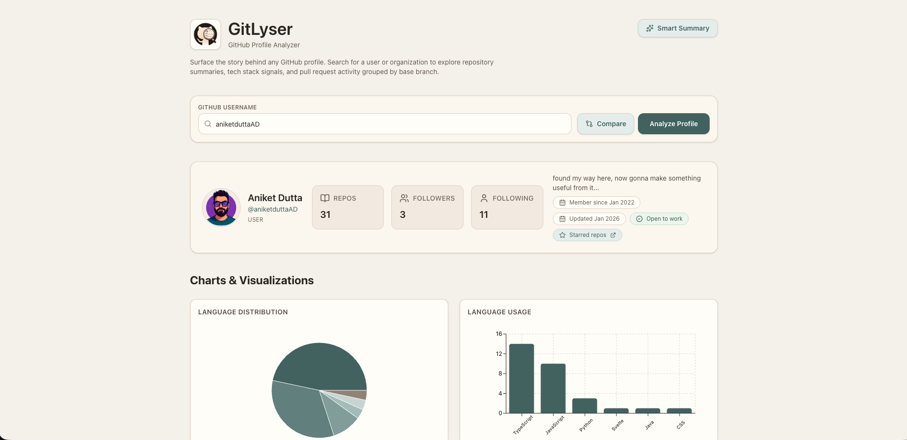
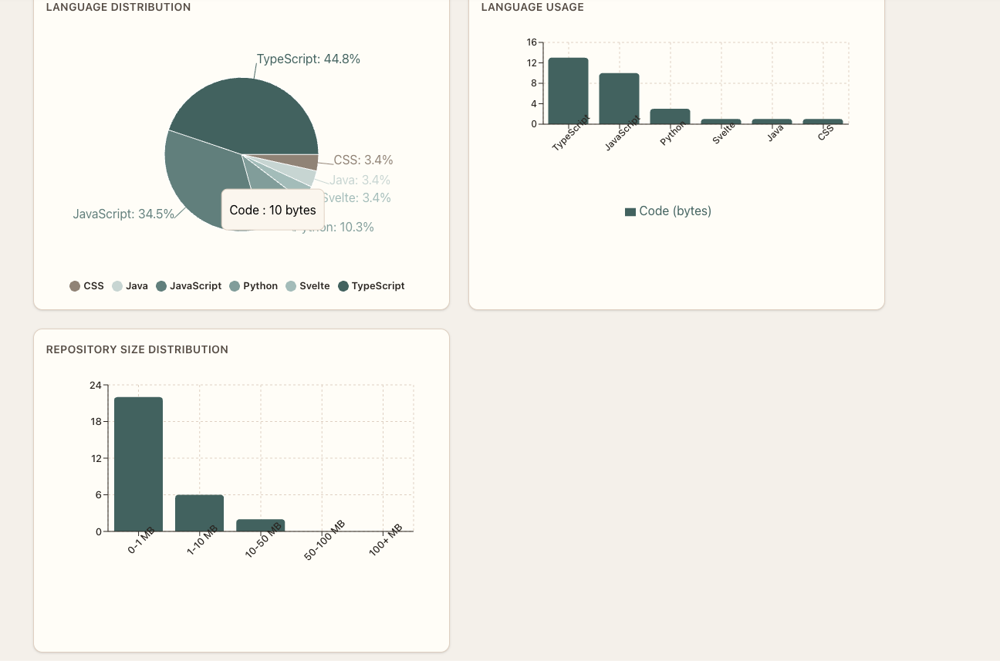
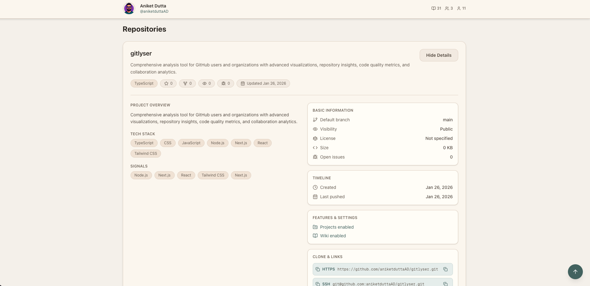
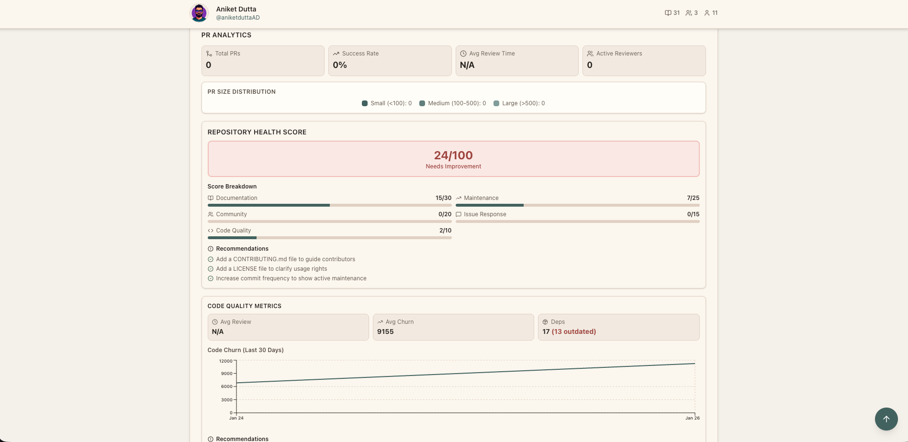

# GitLyser

**GitHub Profile Analyzer** - Comprehensive analysis tool for GitHub users and organizations with advanced visualizations, repository insights, code quality metrics, and collaboration analytics.

## 📸 Screenshots


_Main GitLyser dashboard with key profile analytics_


_Detailed repository cards with summaries and metrics_


_Contribution heatmap and activity timeline visualizations_


_Code quality metrics and pull request analytics dashboard_

## 🚀 Quick Start

### 1. Install Dependencies

```bash
npm install
```

### 2. Setup GitHub Token (Optional but Recommended)

**Get Your Token:**

1. Go to [GitHub Settings → Developer settings → Personal access tokens](https://github.com/settings/tokens)
2. Click "Generate new token" → "Generate new token (classic)"
3. Name: `GitLyser`
4. Expiration: Choose your preference
5. Scopes: Select `public_repo` (read-only)
6. Click "Generate token" and **copy it immediately**

**Where to Add:**

**Local Development:**

- Create `.env.local` file in the project root
- Add: `GITHUB_TOKEN=your_token_here`

**Production (Vercel):**

- Go to Vercel Dashboard → Your Project → Settings → Environment Variables
- Add `GITHUB_TOKEN` with your token value
- Select environments: Production, Preview, Development
- Redeploy your application

**Why?** Increases rate limits from 60/hour (unauthenticated) to 5,000/hour (authenticated). **FREE** - no charges.

### 3. Setup OpenAI Key (Optional - For Smart Summary)

**Get Your Key:**

1. Go to [OpenAI Platform → API Keys](https://platform.openai.com/api-keys)
2. Click "Create new secret key"
3. Name it and copy the key

**Where to Add:**

- Click the **"Smart Summary"** button in the app header (top-right on desktop and mobile)
- Enter your OpenAI API key in the modal
- Click "Save Settings"
- Key is stored securely in your browser's local storage (never sent to our servers)

**Why?** Enables AI-powered repository summaries. Subject to OpenAI's pricing.

### 4. Run Development Server

```bash
npm run dev
```

Open [http://localhost:3000](http://localhost:3000) to start analyzing profiles.

## ✨ Features

### Profile Analysis

- Analyze any GitHub user or organization with profile overview, stats, and search functionality
- Sticky header keeps profile info visible while scrolling
- Fully responsive design for desktop, tablet, and mobile

### Data Visualizations

- **Language Distribution** - Interactive pie chart of programming languages
- **Language Usage** - Bar chart with detailed statistics and percentages
- **Repository Size Distribution** - Visual breakdown of repository sizes
- **Contribution Heatmap** - GitHub-style contribution calendar with year selection
- **Activity Timeline** - Chronological timeline of commits, PRs, issues, repos, and stars with filtering

### Repository Insights

- Expandable repository cards with comprehensive details
- Heuristic-based summaries from README, dependencies, and file structure
- **Smart Summary** - AI-powered summaries using OpenAI GPT-4o-mini (optional, requires API key)
- Automatic tech stack detection from README, package files, and file structure
- Language statistics, topics, and tags

### Repository Details

- Project overview with AI-powered summaries
- Tech stack detection and detected features (tests, docs, CI/CD, Docker, config files)
- Documentation highlights (README excerpts, CONTRIBUTING.md, CHANGELOG.md, etc.)
- Basic information, timeline, settings, statistics, and clone URLs
- Pull requests grouped by base branch with recent activity

### Pull Request Analytics

- PR metrics dashboard with total PRs, success rate, and average review time
- Active reviewers list (top 10) and PR size distribution (Small/Medium/Large)
- Analyzes up to 50 most recent PRs with IQR outlier filtering
- PRs grouped by base branch with recent activity

### Repository Health Score

- 0-100 health score with visual indicators and color-coded status
- Score breakdown across 5 categories: Documentation, Maintenance, Community, Resolution Time, Code Quality
- Improvement recommendations based on score analysis

### Code Quality Metrics

- Average PR review time with outlier filtering (analyzes up to 50 PRs)
- Average code churn per commit (analyzes up to 100 commits, excludes merge commits)
- Dependency health tracking from package files
- Code churn trends visualization over last 30 days
- Quality recommendations and interactive charts

### Comparison View

- Compare up to 3 GitHub profiles side-by-side
- Compare metrics, languages, and activity across profiles
- AI-powered comparison insights using GPT-4o-mini (optional, requires API key)
- Supports overall, technical skills, and role match comparisons

### Additional Features

- **Metrics Info Modal** - Detailed explanations of all calculations (click "Info" button)
- **Mobile-Optimized** - Bottom sheet layout for mobile devices
- **Accessible UI** - ARIA labels, keyboard navigation, semantic HTML
- Loading states, error handling, and one-click copy functionality

## 🔒 Security

- **GitHub Token**: Stored server-side only, never exposed to client
- **OpenAI Key**: Stored in browser localStorage, never sent to our servers
- **Input Validation**: All inputs sanitized to prevent injection attacks
- **Error Sanitization**: Tokens never appear in error messages
- **Security Headers**: Production-grade security headers enabled
- **Graceful Degradation**: App works without tokens (with lower rate limits)

## 🛠️ Tech Stack

- **Next.js 16** - React framework with App Router
- **Next.js API Routes** - Serverless API endpoints
- **TypeScript** - Type safety
- **Tailwind CSS 4** - Modern styling
- **GitHub REST API** - Profile, repository, and PR data
- **GitHub GraphQL API** - Contribution calendar data
- **OpenAI API** - AI summaries and comparisons (optional)
- **Recharts** - Interactive charts and visualizations
- **React Markdown** - Markdown rendering for READMEs
